# Climate Resilient Infrastructure in Chicago

## Introduction 

This project examines 2006-2025 building permit data in the City of Chicago to identify spatial and temporal trends in climate infrastructure development relative to climate infrastructure policies and neighborhood demographics. 

## Data

The City of Chicago maintains an online dataset with a record for every permit request filed, with information about the address of the property, the name of the person who filed the request, and the type of work that will be done at the property. The dataset ranges from 2006-2026, but for the purposes of this analysis, only 2006-2025 are included as 2026 has incomplete data.
The dataset used in this project can be found at the [City of Chicago's Data Portal](https://data.cityofchicago.org/Buildings/Building-Permits/ydr8-5enu/about_data), as can the [City of Chicago boundary](https://data.cityofchicago.org/Facilities-Geographic-Boundaries/Boundaries-City-Map/ewy2-6yfk), which was used for spatial analysis and visualization.

Additionally, Census Bureau data was used for demographic purposes and geospatial visualization. American Community Survey 5-Year Estimates for Cook County (by census tract) with demographic data can be found [here](https://data.census.gov/table?g=050XX00US17031$1400000&y=2024), and cartographic shapefiles for geospatial visualization can be found [here](https://www.census.gov/geographies/mapping-files/time-series/geo/cartographic-boundary.html) on the Census Bureau's website.

## Scripts 

The scripts are organized in the following order: `1-collect_permits.py` -> `2-census_api.py` -> `3-permit_analysis.py` -> `4-census_analysis.py` -> `5-equity_race_analysis.py` -> `6-geo_analysis.qgz`.

1. `1-collect_permits.py`

This script uses the City of Chicago's API to pull building permit data for the requested variables and writes them into a CSV file called `chicago_building_permits.csv`. It also pulls column metadata for those same variables into a separate dataframe and saves that as `chicago_building_permits_metadata.csv`.

2. `2-census_api.py`

This script pulls census variables from the Census Bureau ACS as specified in the file list and organizes them into a dataframe with readable names. It calculates variables including poverty rate, unemployment rate, and percentage of the population with a bachelor's degree or higher. It then saves the dataframe as `chicago_census_data.csv`.

3. `3-permit_analysis.py`

This script adds column to the permit dataframe for issue day, month, and year by parsing the issue date category. It then separates out solar, flood mitigation, and green infrastructure permits out into separate dataframes based on if the keywords below were in the work description or type fields:

- __Solar__: solar, Small-Scale Solar PV System
- __Flood Mitigation__: flood, rain, stormwater, storm water
- __Green Infrastructure__: green roof, plant, planting, plants, or any of the other words and tree or trees

Then, the script creates bar charts for each of the three types showing permits by year. It stacks the three permit types into one dataset and visualizes all permit types by year before saving the permit data as CSV files and geopandas files.

4. `4-census_analysis.py`

This script downloads census tract cartographic shapefile data and merges the spatial data with the census demographic data before being reprojected to UTM 18N and clipped to the Chicago city boundary. It then converts permit data to a geodataframe and merges permit data with the census geodataframe before saving all spatial data to `chicago.gpkg`.

5. `5-equity_race_analysis.py`

This script analyzes and creates visualizations for:

- total permit counts by year
- permit rate by tract income quartile
- permit rate by tract racial majority
- median income vs permit rate
    - with vs without 99% outliers
- poverty rate vs permit rate 
    - with vs without 99% outliers
- permit counts by year and income quartile
    - solar
    - flood mitigation
    - green infrastructure

It then saves all visualizations in the Visualizations folder.

6. `6-geo_analysis.qgz`

This is a QGIS project with layers for census tracts, permit counts, and demographic census variables.

## Results

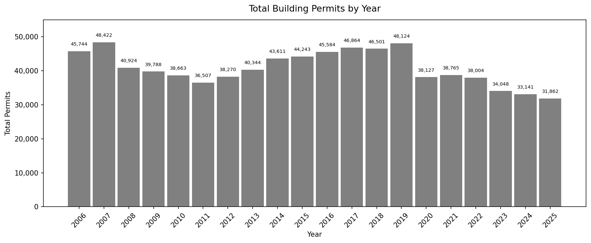

This figure shows the total building permits by year. Permit requests peaked just before the recession in 2008 and the pandemic in 2020, when development was presumably at its highest volume. 

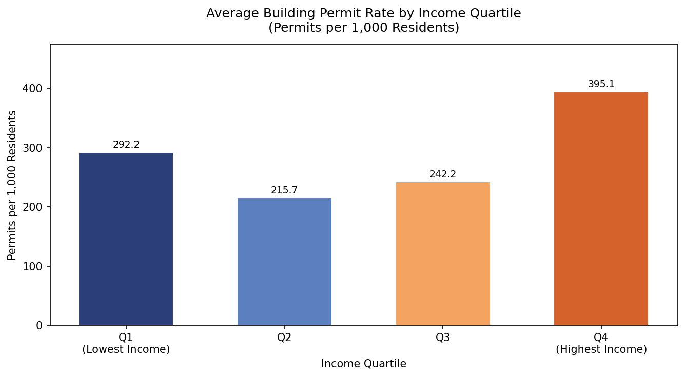

This figure shows the average permit rate per 1,000 residents based on income quartile of a census tract. The highest income quartile tracts have the highest average permit rate at 395.1 permits per 1,000 residents, but the lowest income quartile tracts have the second highest average permit rate at 292.2 permits per 1,000 residents.

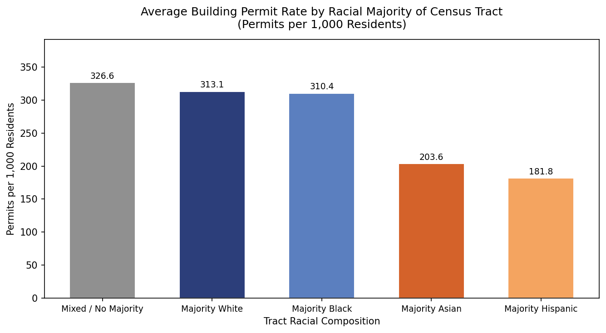

This figure shows the average permit rate per 1,000 residents based on racial majority in a census tract. Mixed race tracts have the highest permit rate at 326.6 permits per 1,000 residents, while majority white and majority Black tracts follow closely behind at 313.1 and 310.4 permits per 1,000 residents respectively. Majority Asian and majority Hispanic tracts have much lower average permit rates.

| | |
|---|---|
| 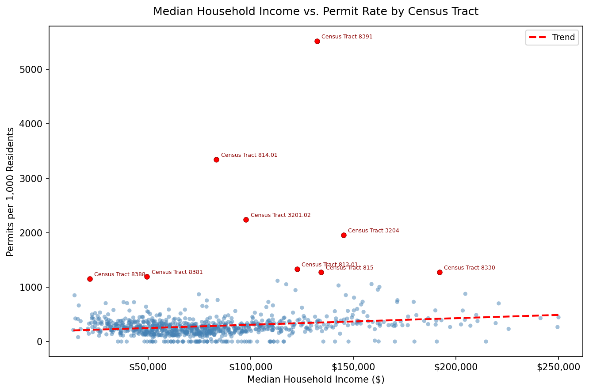 | 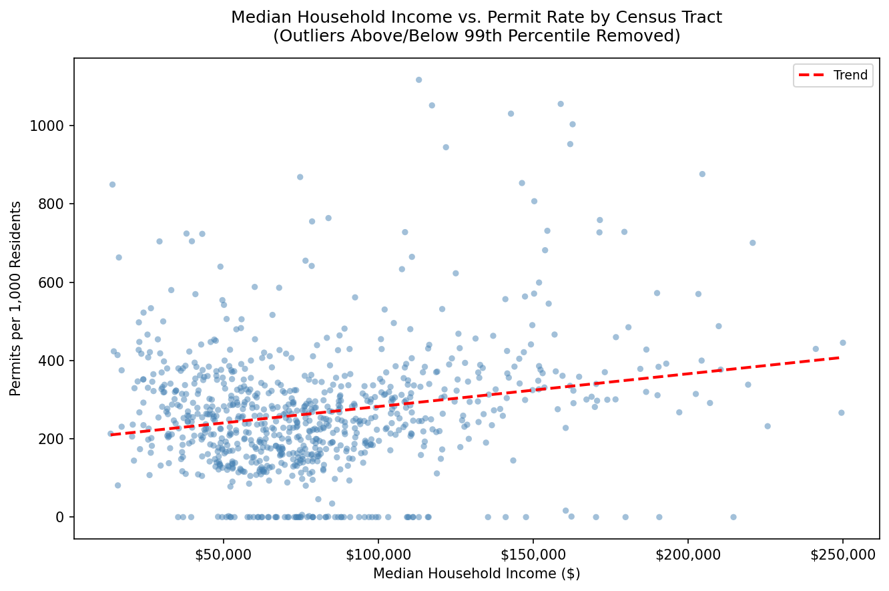 |
| 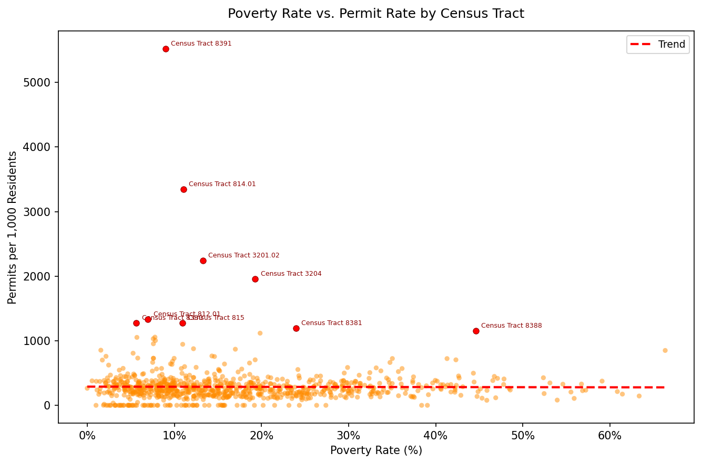 | 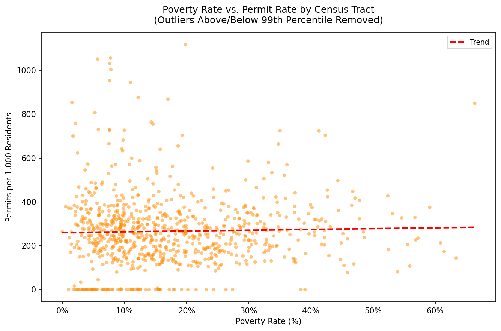 |

These figures are scatter plots showing the correlation between median household income and poverty rates with permit rates by census tract. The two figures on the left are skewed by outlier census tracts (highlighted in red) like those in the Financial District, so the two figures on the right show the plots with the 99th percentile outliers removed. It is easier to then see the clear positive correlation between median household income and permit rate.

| | |
|---|---|
| 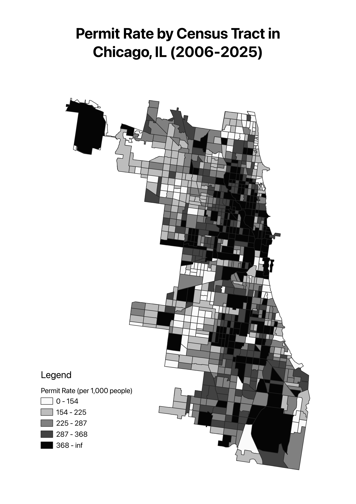 | 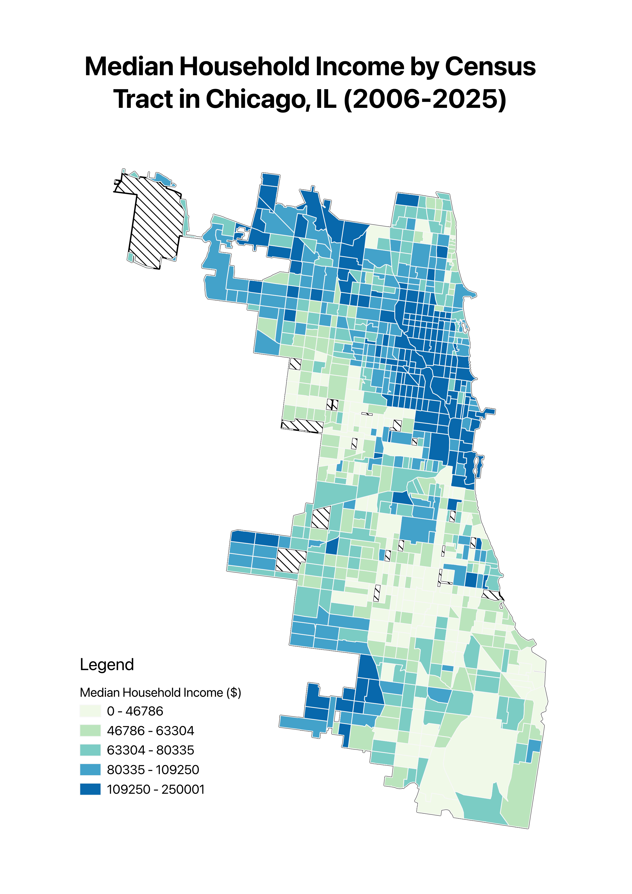

These maps show the City of Chicago broken down by census tract. The map on the left shows permit rate by tract, with darker colors representing a higher permit rate. The map on the right shows median income by tract, with darker colors representing higher median income. The two maps show a correlation between higher permit rates and median income in the northeast part of the city, but the southeast area of the city has a high median income and a low permit rate, showing that the two are not always directly correlated.

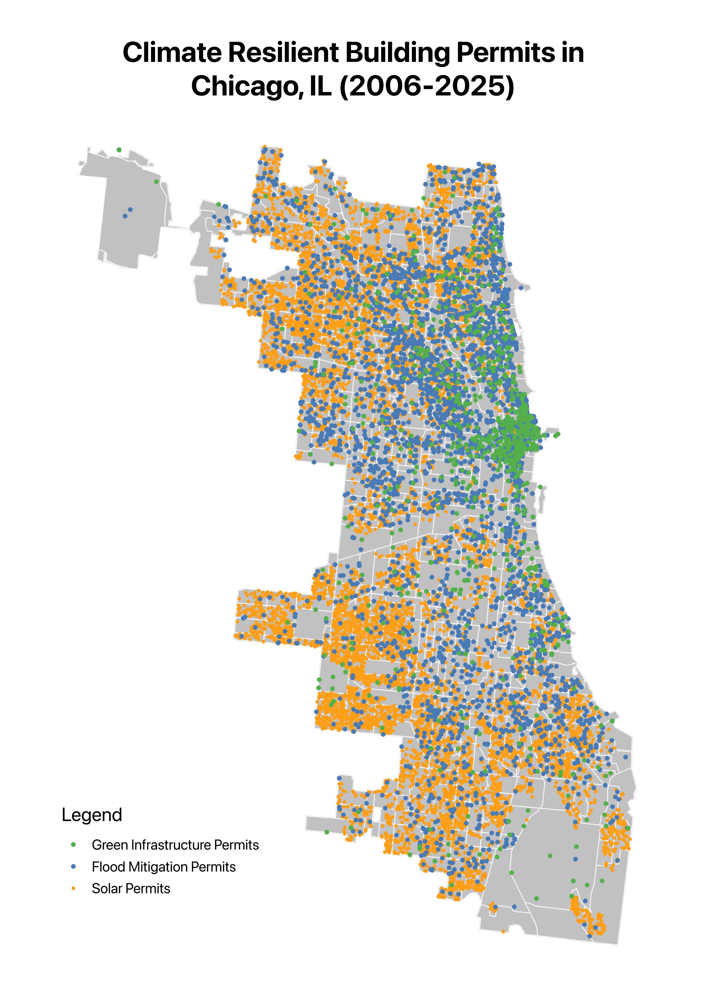

This map shows the location of climate resilient permits throughout Chicago. Many of the flood mitigation and green infrastructure permits are clustered around downtown Chicago and the financial district, but solar permits are more evenly spread out among the city, including among census tracts with lower median income.

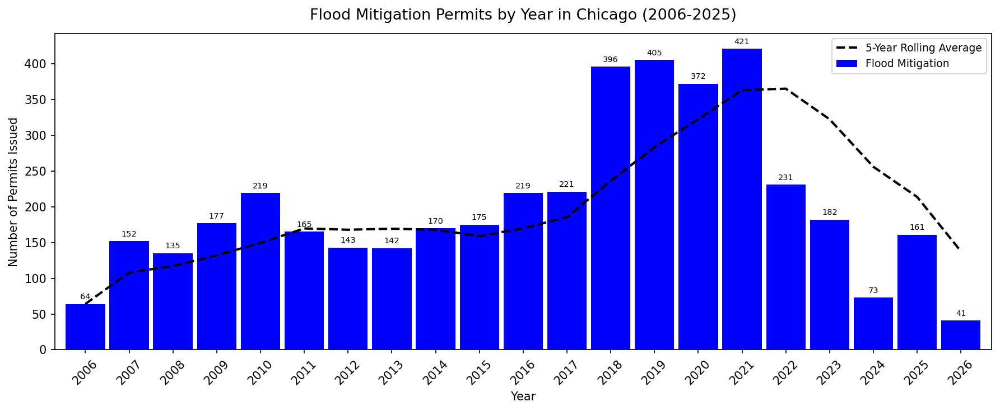
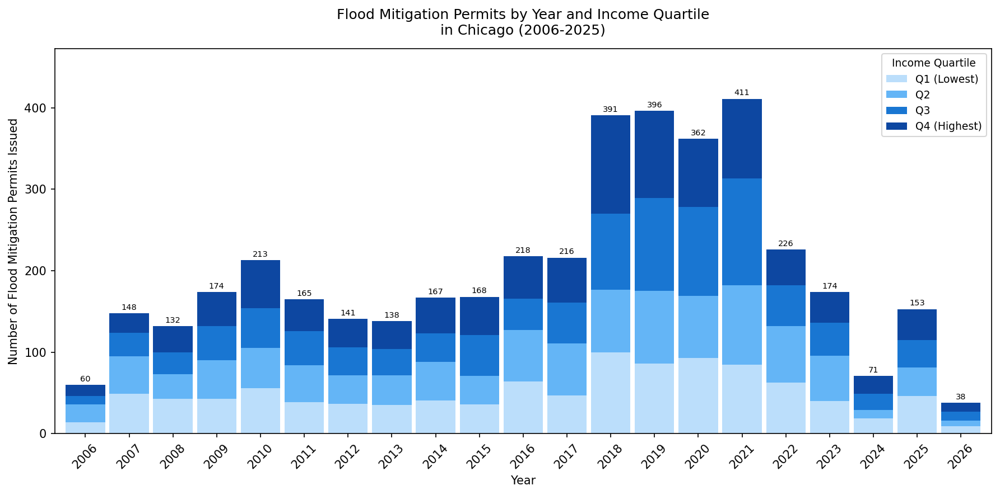

These figures show the number of flood mitigation permits issued per year, and the figure on the bottom shows a breakdown by income quartile among census tracts where the permit was issued. Flood mitigation permit numbers were the highest around 2018-2021 and have since dipped, but they have remained somewhat evenly distributed for income quartiles over all 20 years.

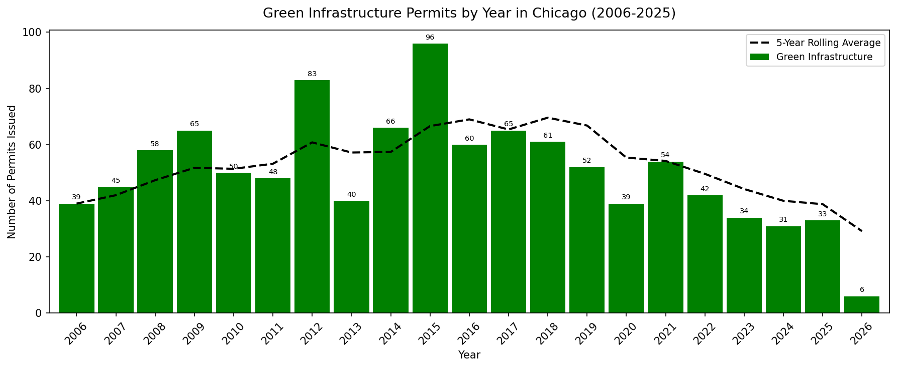
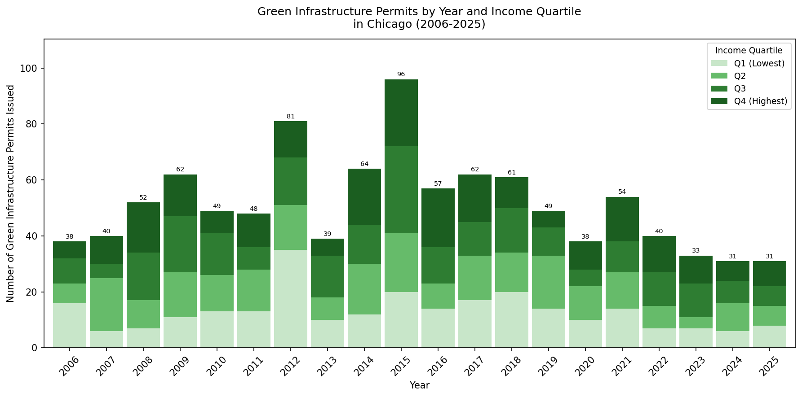

These figures show the number of green infrastructure permits issued per year, and the figure on the bottom shows a breakdown by income quartile among census tracts where the permit was issued. Green infrastructure permit numbers saw peaks in 2012 and 2015, with a large number of low income permits in 2012. The number of permits issued per year has remained low since 2022. 

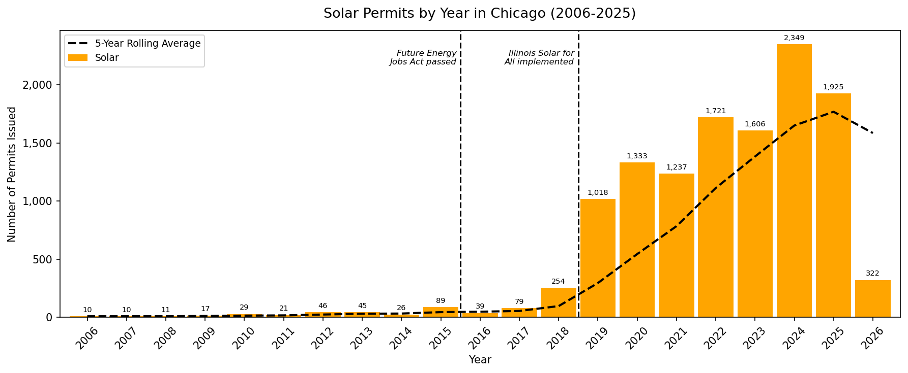
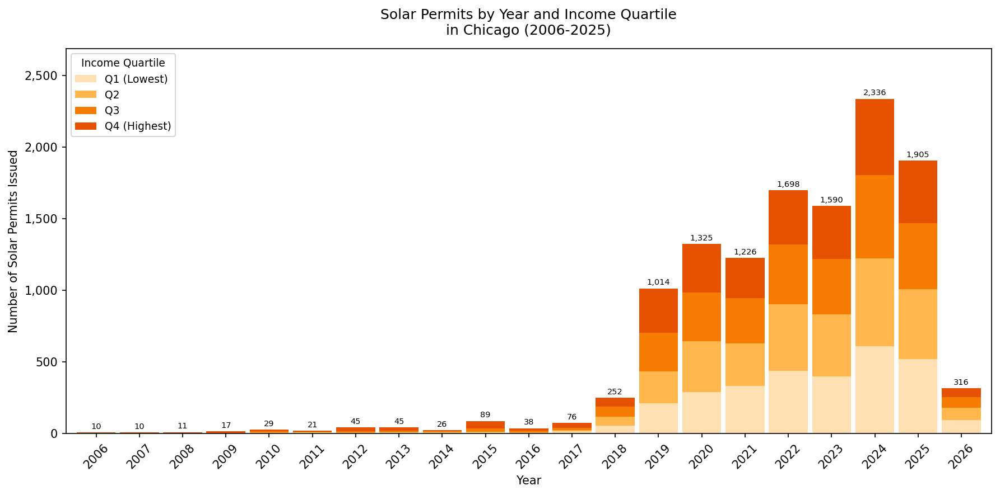

These figures show the number of solar permits issued per year, and the figure on the bottom shows a breakdown by income quartile among census tracts where a permit was issued. Solar permit numbers rose rapidly after 2018, where the Illinois Solar for All and Illinois Shines programs were implemented following the passing of the Future Energy Jobs Act in 2016. The distribution of permits is consistenly evenly disributed by income quartile.

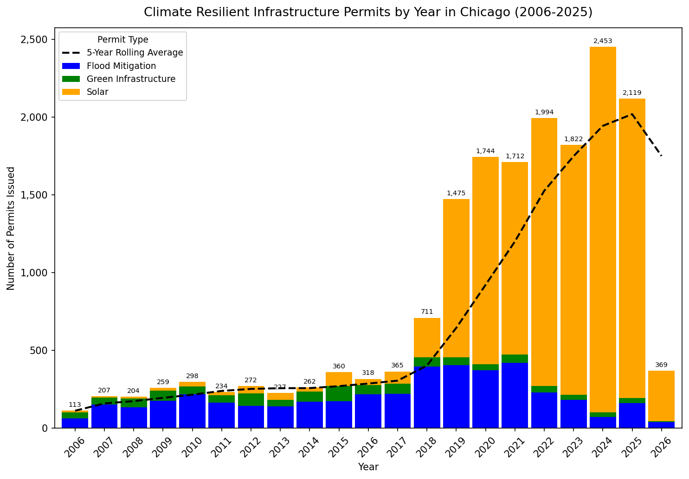

This figure shows the total number of climate resilient permits issued by year, classified by permit type (solar, flood mitigation, and green infrastructure). It is clear that the Future Energy Jobs Act and subsequent programs had a real impact on the number of climate resilient permits being issued by the City of Chicago, and these effects were not just for areas with high median incomes or only for majority white census tracts. The benefits of climate resilient infrastructure can be felt by all thanks to policies and programs that make it easier to incorporate resilience into buildings. 